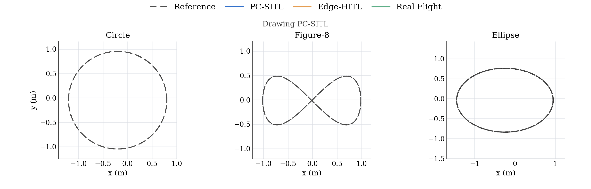
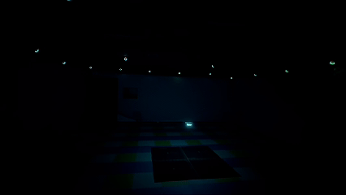
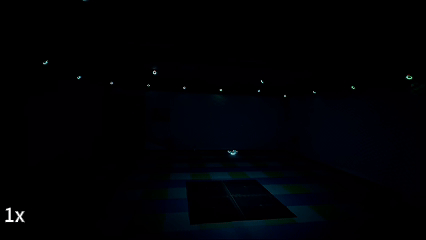
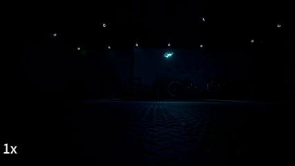
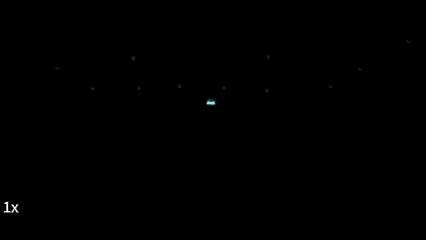
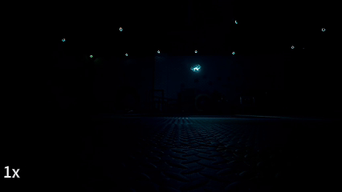
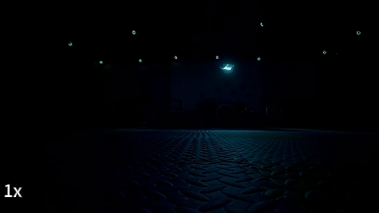
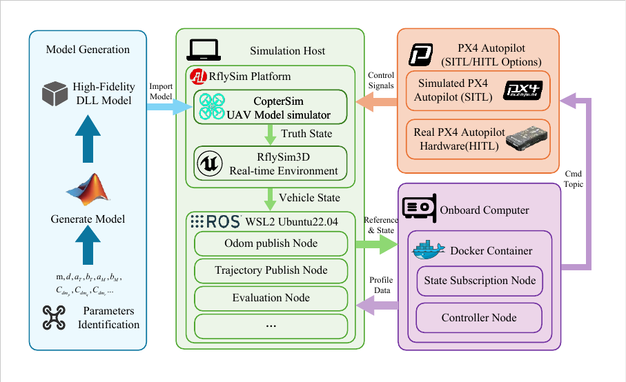
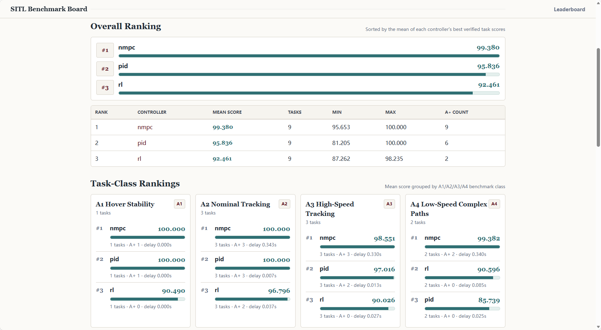

<div align="center">

# RflyArena

**RflyArena: A Unified Testing and Deployment Framework for UAV Controllers from SITL to Real Flight**

[](LICENSE)


[](https://github.com/swZheng888/RflyArena)

</div>

RflyArena is an end-to-end benchmark toolkit for reproducible UAV controller evaluation across desktop simulation, constrained edge deployment, and real-flight validation. It packages the ROS interfaces, controller baselines, benchmark task manager, logging/analysis scripts, Docker resource profiles, and Windows-side RflySim assets needed to reproduce the evaluation pipeline described in the paper.

**Quick links:** [What It Does](#what-it-does) • [Quick Demo](#quick-demo) • [Benchmark Demos](#benchmark-demos) • [Build](#build) • [Evaluation Workflow](#paper-aligned-evaluation-workflow) • [Local Ranking Submission](#local-ranking-submission) • [Docker Workflow](#docker-workflow) • [Repository Layout](#repository-layout)

## What It Does

<table>
  <tr>
    <td width="33%">
      <strong>Run UAV benchmark tasks</strong><br/>
      <sub>Hover, circle, figure-8, ellipse, disturbance, repeated real-flight tasks, and CSV-based reference trajectories.</sub>
    </td>
    <td width="33%">
      <strong>Compare controllers fairly</strong><br/>
      <sub>Evaluate PID/SO(3), NMPC, and RL baselines through the same ROS topics, task manager, and metric pipeline.</sub>
    </td>
    <td width="33%">
      <strong>Bridge sim to hardware</strong><br/>
      <sub>Reuse one workflow across PC-SITL, edge-constrained HITL containers, and safety-gated real-flight validation.</sub>
    </td>
  </tr>
  <tr>
    <td width="33%">
      <strong>Emulate edge compute</strong><br/>
      <sub>Use Docker/Cgroups profiles for Jetson, Raspberry Pi, and FMU-like CPU/memory constraints.</sub>
    </td>
    <td width="33%">
      <strong>Log and analyze results</strong><br/>
      <sub>Record bags, compute tracking metrics, generate summaries, and create publication-style benchmark plots.</sub>
    </td>
    <td width="33%">
      <strong>Tune automatically</strong><br/>
      <sub>Run Optuna-based parameter search for deployment-sensitive controller settings.</sub>
    </td>
  </tr>
</table>

## Quick Demo

The fastest demo is a PC-SITL tracking task: start RflySim/PX4/MAVROS first, launch one controller, then launch the benchmark task in another terminal.

**1. Build and source**

```bash
cd RflyArena
catkin build
source devel/setup.bash
```

**2. Start a controller**

```bash
roslaunch nmpc_control rflysim_nmpc.launch
```

**3. Run a benchmark task**

```bash
roslaunch benchmark_utils benchmark.launch \
  task_type:=dynamic \
  trajectory_type:=circle \
  speed_level:=1.0 \
  odom_topic:=/vio/odometry_enu \
  coordinate_frame:=1
```

Switch the demo by changing only the controller launch file and trajectory argument:

| Try this | Command / argument |
| --- | --- |
| PID/SO(3) controller | `roslaunch Px4Ctrl rflysim_pid.launch` |
| RL controller | `roslaunch rl_control rflysim_rl.launch` |
| Figure-8 task | `trajectory_type:=figure8` |
| Faster tracking | `speed_level:=3.0` |

## Benchmark Demos

<div align="center">
  
  <br/>
  <sub><strong>Multi-trajectory benchmark overview</strong> · synchronized tracking visualization across representative tasks</sub>
</div>

<br/>

<table>
  <thead>
    <tr>
      <th width="16%">Controller</th>
      <th width="42%">Circle</th>
      <th width="42%">Figure-8</th>
    </tr>
  </thead>
  <tbody>
    <tr>
      <td align="center">
        <strong>NMPC</strong><br/>
        <sub>optimization-based</sub>
      </td>
      <td align="center">
        
      </td>
      <td align="center">
        
      </td>
    </tr>
    <tr>
      <td align="center">
        <strong>PID/SO(3)</strong><br/>
        <sub>classical baseline</sub>
      </td>
      <td align="center">
        
      </td>
      <td align="center">
        
      </td>
    </tr>
    <tr>
      <td align="center">
        <strong>RL</strong><br/>
        <sub>policy baseline</sub>
      </td>
      <td align="center">
        
      </td>
      <td align="center">
        
      </td>
    </tr>
  </tbody>
</table>

## Architecture Overview

<div align="center">
  
</div>

RflyArena couples the simulator, benchmark task publisher, and controller stack through a unified ROS interface so that the same benchmark tasks can be executed consistently in desktop simulation, constrained edge deployment, and real-flight validation.

## Repository Layout

- `src/benchmark_utils`: benchmark orchestration, logging, tuning, analysis, and report generation
- `src/nmpc_control`: NMPC controller package
- `src/Px4Ctrl`: PX4-based baseline controller package
- `src/quadrotor_msgs`: custom ROS messages
- `src/rl_control`: RL controller package and policy assets
- `src/trajectory_publisher`: reference trajectory publication and task generation
- `src/uav_utils`: shared UAV utility code
- `docker/`: containerized deployment and resource-constrained benchmark workflow
- `tools/benchmark_proof_tool`: binary proof signer/verifier used by local ranking submissions
- `benchmark_results/`: example signed local-ranking package
- `windows/rflysim`: Windows-side RflySim startup scripts and the DLL dynamics model used by CopterSim

## Requirements

- Ubuntu with a ROS 1 catkin workspace
- `catkin build` or `catkin_make`
- MAVROS / PX4 runtime support for controller experiments
- Python dependencies required by the benchmark and controller scripts

## Build

```bash
cd RflyArena
catkin build
source devel/setup.bash
```

If `catkin build` is unavailable:

```bash
catkin_make
source devel/setup.bash
```

## Controller Entry Points

Windows-side RflySim startup assets:

```bat
windows\rflysim\SITLRun.bat
windows\rflysim\HITLRun.bat
```

The accompanying `windows/rflysim/FX150_H_Model.dll` file is copied into `C:\PX4PSP\CopterSim\external\model\` by the batch scripts before launching CopterSim.

PX4 baseline controller in RflySim:

```bash
roslaunch Px4Ctrl rflysim_pid.launch
```

NMPC controller in RflySim:

```bash
roslaunch nmpc_control rflysim_nmpc.launch
```

RL controller in RflySim:

```bash
roslaunch rl_control rflysim_rl.launch
```

Real-flight controller entry points:

```bash
roslaunch nmpc_control real_exp.launch
roslaunch rl_control real_rl.launch
```

Reusable benchmark launch files:

```bash
roslaunch benchmark_utils benchmark.launch
roslaunch benchmark_utils host_benchmark.launch
roslaunch benchmark_utils real_benchmark.launch
roslaunch benchmark_utils real_benchmark_repeated.launch
roslaunch benchmark_utils comprehensive_benchmark.launch
```

Reference trajectory publisher:

```bash
roslaunch trajectory_publisher trajectory.launch
```

## Paper-Aligned Evaluation Workflow

The paper evaluates controllers through a three-stage chain: PC-SITL, Edge-HITL, and Real Flight. The commands below map each stage to the launch files and scripts included in this repository.

### 1. PC-SITL: controller evaluation in RflySim

Start the simulator and ROS bridge first. In a typical setup this means `roscore`, PX4/MAVROS, and the RflySim data bridge are already running before the controller is launched.

On Windows, the repository includes the original RflySim launchers used to start the simulator side:

```bat
windows\rflysim\SITLRun.bat
```

Start one controller:

```bash
roslaunch Px4Ctrl rflysim_pid.launch
# or
roslaunch nmpc_control rflysim_nmpc.launch
# or
roslaunch rl_control rflysim_rl.launch
```

Run the benchmark node separately so that the same task definitions can be reused across controllers:

```bash
roslaunch benchmark_utils benchmark.launch \
    task_type:=dynamic \
    odom_topic:=/vio/odometry_enu \
    coordinate_frame:=1 \
    trajectory_type:=circle \
    speed_level:=1.0
```

Useful variants:

```bash
roslaunch benchmark_utils benchmark.launch task_type:=hover
roslaunch benchmark_utils benchmark.launch task_type:=dynamic trajectory_type:=figure8 speed_level:=3.0
roslaunch benchmark_utils benchmark.launch task_type:=dynamic trajectory_type:=ellipse speed_level:=1.0
```

### 2. Edge-HITL: constrained onboard-compute evaluation with Docker

This is the deployment-oriented workflow used in the paper. The recommended architecture keeps RflySim, PX4-SITL, MAVROS, odometry conversion, and trajectory publication on the host, while the controller alone runs inside a CPU- and memory-constrained container.

Build the image:

```bash
cd docker
./scripts/build.sh
```

Host-side prerequisites:

```bash
roscore
roslaunch mavros px4.launch fcu_url:=udp://:14540@127.0.0.1:14557
rosrun nmpc_control rflysim_odom_node.py
```

Run a constrained benchmark:

```bash
./scripts/run_benchmark.sh -p jetson_nano -c nmpc -t circle
./scripts/run_benchmark.sh -p rpi4 -c pid -t figure8 -s 1.5
./scripts/run_benchmark.sh -p jetson_nano -c rl -t ellipse -s 1.0
```

If the controller container is already running, publish the host-side benchmark task directly:

```bash
roslaunch benchmark_utils host_benchmark.launch \
    task_type:=dynamic \
    trajectory_type:=circle \
    speed_level:=1.0 \
    duration:=30
```

### 3. Real Flight: hardware validation and safety-gated execution

For real-flight experiments, start the controller node first, then launch the task sequencer used in the paper. The real benchmark node is intentionally start-gated so that takeoff and task execution are triggered manually.

Start one controller:

```bash
roslaunch nmpc_control real_exp.launch
# or
roslaunch rl_control real_rl.launch
```

Launch the repeated evaluation workflow you typically use:

```bash
roslaunch benchmark_utils real_benchmark_repeated.launch \
    controller_name:=nmpc \
    tasks_file:=$(rospack find benchmark_utils)/config/real_benchmark_tasks.yaml \
    odom_topic:=/vio/odometry_enu \
    repeats:=1 \
    run_analysis:=true \
    record_bag:=true
```

Manual task control:

```bash
rostopic pub /real_benchmark/start std_msgs/Empty "{}"
rostopic pub /real_benchmark/abort std_msgs/Empty "{}"
```

If rosbag logging is required during real-flight experiments:

```bash
roslaunch benchmark_utils real_benchmark_repeated.launch \
    controller_name:=nmpc \
    tasks_file:=$(rospack find benchmark_utils)/config/real_benchmark_tasks.yaml \
    repeats:=10 \
    record_bag:=true \
    odom_topic:=/vio/odometry_enu
```

### 4. Batch experiments and repeated runs

For automated sweeps over multiple trajectories or task configurations:

```bash
roslaunch benchmark_utils comprehensive_benchmark.launch
```

After each task, `benchmark_analyzer.py` writes a signed `proof.zip` next to the task CSV. At the end of repeated benchmark runs, RflyArena also creates a complete upload package:

```text
<results_dir>/local_rank_ready/
<results_dir>/local_rank_ready.zip
```

The automatic package step is enabled by default in `real_benchmark_repeated.launch` and can be disabled when needed:

```bash
roslaunch benchmark_utils real_benchmark_repeated.launch \
    controller_name:=nmpc \
    generate_submission_package:=false
```

For Docker-based comparison batches under several compute profiles:

```bash
cd docker
./scripts/run_comparison.sh
./scripts/run_comparison.sh --quick
```

### 5. Automatic tuning with Optuna

The repository also includes the Optuna-based tuning workflow used to configure deployment-sensitive controller parameters before the main benchmark comparison.

Single-trajectory tuning example:

```bash
python3 src/benchmark_utils/scripts/auto_tuner.py \
    --controller nmpc \
    --trajectory circle \
    --trials 10
```

Multi-trajectory tuning example:

```bash
python3 src/benchmark_utils/scripts/auto_tuner.py \
    --controller nmpc \
    --trajectory "circle,figure8,ellipse" \
    --trials 20
```

The auto-tuner expects the ROS environment, controller topics, and benchmark pipeline to be available. In practice, it is typically used after the relevant simulation/controller stack has been brought up for PC-SITL evaluation.

Tuning outputs are written under `tuning_results/`, including the Optuna database and the best parameter summary for each run.

## Local Ranking Submission

RflyArena can generate a self-contained local-ranking submission package after benchmark evaluation. The package is intended for leaderboard upload without rerunning the whole controller benchmark on the server.

An internal SITL Benchmark Board is maintained for comparing verified controller submissions. It reports the overall ranking by mean verified score and task-class rankings for A1 hover stability, A2 nominal tracking, A3 high-speed tracking, and A4 low-speed complex paths. The public leaderboard URL will be added here after paper acceptance.

<div align="center">
  
  <br/>
  <sub><strong>SITL Benchmark Board preview</strong> · overall and task-class rankings from verified local submission packages</sub>
</div>

Each task analysis produces:

```text
<task_dir>/proof.zip
```

Each `proof.zip` contains:

```text
result.csv
manifest.json
signature.txt
```

The manifest records the CSV hash, row count, score, grade, task name, phase delay, and scoring mode. The signature is generated by the bundled `tools/benchmark_proof_tool` binary. This is designed to catch ordinary CSV edits before upload.

Generate a complete upload package manually:

```bash
python3 src/benchmark_utils/scripts/generate_submission_package.py \
    --results-dir <results_dir> \
    --controller nmpc \
    --select-best \
    --analyze-missing \
    --no-plot
```

Output:

```text
<results_dir>/local_rank_ready/summary.csv
<results_dir>/local_rank_ready/<controller>/*_proof.zip
<results_dir>/local_rank_ready.zip
```

`--select-best` keeps the best proof for each repeated task. `--analyze-missing` runs `benchmark_analyzer.py` for task directories that contain CSV files but do not yet contain `proof.zip`.

An example package is included at:

```text
benchmark_results/local_rank_ready.zip
benchmark_results/local_rank_ready/
```

The local proof signer is distributed as a stripped Linux x86-64 binary. It is a lightweight tamper check for normal leaderboard use, not a cryptographic guarantee against a determined reverse engineer. For high-stakes public competitions, re-check or re-sign submissions on a private server.

## Docker Workflow

Build the benchmark image:

```bash
cd docker
./scripts/build.sh
```

Run a benchmark under a resource profile:

```bash
./scripts/run_benchmark.sh -p jetson_nano -c nmpc -t circle
./scripts/run_benchmark.sh -p rpi4 -c pid -t figure8 -s 1.5
```

Run comparison batches:

```bash
./scripts/run_comparison.sh
./scripts/run_comparison.sh --quick
```

## Windows RflySim Assets

The `windows/rflysim/` directory contains the Windows-side launcher scripts used with the RflySim/CopterSim environment:

- `SITLRun.bat`: starts PX4 SITL-based multi-vehicle simulation in RflySim
- `HITLRun.bat`: starts PX4 HITL simulation and binds each vehicle to a Pixhawk COM port
- `FX150_H_Model.dll`: DLL-based dynamics model copied into CopterSim before launch

By default the scripts expect the simulator toolchain under `C:\PX4PSP`. If your local RflySim installation lives elsewhere, edit the `PSP_PATH` and `PSP_PATH_LINUX` variables at the top of the batch files before running them.

## License

This repository is released under the MIT License. See [LICENSE](LICENSE).
